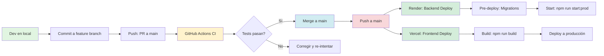

# Deploy automatizado a PROD

## 🔄 Flujo CI/CD completo



## Stack

| Componente | Servicio | Qué hace |
|------------|----------|----------|
| **Backend** | [Render](https://render.com) | NestJS, se despliega con cada push a `main` |
| **Frontend** | [Vercel](https://vercel.com) | React/Vite, se despliega con cada push a `main` |
| **Base de datos PROD** | [Supabase](https://supabase.com) | PostgreSQL (variables en Render) |

No hace falta “subir a mano”: **push a `main`** dispara el deploy del backend y del frontend. Si además tenés **GitHub Actions** (ver más abajo), los tests corren antes y podés proteger la rama para que solo se mergee si pasan.

---

## Flujo recomendado (lo más automatizado)

1. **Desarrollo en local**  
   Trabajás en una rama, probás con `npm run dev` y `npm test` en backend y frontend.

2. **Merge a `main`**  
   - Si tenés GitHub Actions: los tests se ejecutan; si fallan, corregís antes de mergear (o protegés `main` para que no se mergee si fallan).
   - Al hacer merge/push a `main`, Render y Vercel detectan el cambio y despliegan.

3. **Backend en Render**  
   - **Build:** `npm install && npm run build`  
   - **Pre-deploy (migraciones):** `npm run migration:run:prod` — corre las migraciones pendientes contra la base de Supabase. Si falla, **el deploy se cancela** (no se pone en línea una versión sin migraciones aplicadas).  
   - **Start:** `npm run start:prod`  
   - **Health check:** `GET /api/health` → `{ "status": "ok" }`

4. **Frontend en Vercel**  
   Build y deploy automático; `VITE_API_URL` apuntando a la URL del backend en Render.

5. **Base de datos**  
   Las migraciones se aplican **en el pre-deploy del backend** (comando anterior). No tenés que entrar a Supabase a mano salvo que uses plan gratis de Render y no tengas pre-deploy (ver más abajo).

---

## Migraciones automáticas (Render)

En el repo está configurado en `backend-vevil/render.yaml`:

```yaml
preDeployCommand: npm run migration:run:prod
```

- **Qué hace:** Antes de cada deploy, ejecuta `npx typeorm migration:run -d ./dist/src/data-source.js` usando las variables de entorno de Render (Supabase). Así las migraciones se aplican **antes** de que la nueva versión reciba tráfico.
- **Si falla:** Render no pone en línea el deploy; ves el error en los logs del deploy.
- **Plan gratis de Render:** El *pre-deploy command* puede no estar disponible en el plan gratis. En ese caso:
  - Opción 1: Ejecutar migraciones a mano una vez (SQL en la sección siguiente) o desde tu PC con `DB_*` de PROD.
  - Opción 2: Incluir migraciones en el **start** (menos ideal: se ejecutan en cada reinicio):  
    `startCommand: npm run migration:run:prod && npm run start:prod`  
    Solo si no podés usar pre-deploy.

---

## SQL de respaldo (ejecutar a mano si hace falta)

Si en algún momento tenés que crear la tabla `audit_log` a mano en Supabase (por ejemplo, antes de tener pre-deploy o por un rollback), ejecutá en el **SQL Editor** de Supabase:

```sql
CREATE TABLE "audit_log" (
  "id" SERIAL NOT NULL,
  "userId" uuid,
  "userEmail" character varying(255),
  "action" character varying(64) NOT NULL,
  "entityType" character varying(32) NOT NULL,
  "entityId" character varying(64),
  "oldValue" jsonb,
  "newValue" jsonb,
  "ip" character varying(45),
  "createdAt" TIMESTAMP NOT NULL DEFAULT now(),
  CONSTRAINT "PK_audit_log" PRIMARY KEY ("id")
);
CREATE INDEX "IDX_audit_log_userId" ON "audit_log" ("userId");
CREATE INDEX "IDX_audit_log_entityType_entityId" ON "audit_log" ("entityType", "entityId");
CREATE INDEX "IDX_audit_log_createdAt" ON "audit_log" ("createdAt");
```

---

## GitHub Actions (tests antes del deploy)

En el repo hay un workflow (`vevil-system/.github/workflows/ci.yml`) que, en cada push a `main` (y en PRs hacia `main`):

1. Ejecuta los **tests unitarios del backend** (`backend-vevil`).
2. Ejecuta los **tests unitarios del frontend** (`frontend-vevil`).

Así podés:

- Ver en la pestaña *Actions* si los tests pasan antes de que Render y Vercel terminen el deploy.
- Opcionalmente, en **Settings → Branches → Branch protection** de `main`, exigir que “Status checks” (el workflow de CI) sea exitoso antes de mergear.

El deploy en sí lo siguen haciendo Render y Vercel al hacer push; el CI solo añade la capa de “no subir código que no pase los tests”.

---

## Proteger la rama `main` (que el CI tenga que pasar para mergear)

Así nadie puede mergear a `main` si los tests fallan. Pasos detallados en GitHub:

### Paso 1: Llegar a la configuración de ramas

1. Abrí tu repo en GitHub (ej. `github.com/666Matt666/Vevil`).
2. Arriba del listado de archivos, hacé clic en **Settings** (pestaña; si no la ves, necesitás permisos de admin del repo).
3. En el **menú izquierdo**, dentro de “Code and automation”, hacé clic en **Branches**.
4. En el bloque **Branch protection rules** vas a ver dos botones:
   - **Add branch ruleset** → no uses este para este caso.
   - **Add classic branch protection rule** → hacé clic en este.

### Paso 2: Crear la regla para `main`

En la pantalla nueva:

5. **Branch name pattern**  
   Es el primer campo. Escribí exactamente: `main`  
   (Si en el repo la rama se llama `master`, poné `master`.)

6. **Opciones que conviene activar**  
   Bajá un poco y vas a ver varias casillas. No hace falta tocar “Allow force pushes” ni “Allow deletions”.  
   Activá al menos:
   - **Require status checks to pass before merging**  
     (En español puede decir: “Exigir que pasen las comprobaciones de estado antes de fusionar”).  
     Al activarla suele aparecer debajo un cuadro **“Status checks that are required”** o “Branch status checks”.  
   Opcional (recomendado):
   - **Require a pull request before merging**  
     Así todo entra a `main` por PR y el CI corre antes del merge.

7. **Elegir qué checks son obligatorios**  
   Donde dice **“Status checks that are required”** hay un campo de búsqueda. Ahí tenés que elegir los jobs del workflow de CI:
   - Escribí por ejemplo `Backend` o `backend` y debería aparecer **Backend tests**; seleccionalo.
   - Escribí `Frontend` o `frontend` y debería aparecer **Frontend tests**; seleccionalo.  
   Si **no te aparece ningún check**: es normal la primera vez. Los checks se listan solo después de que el workflow haya corrido al menos una vez en ese repo. En ese caso:
   - Dejá la regla guardada **sin** elegir checks (o solo con “Require status checks” activado y la lista vacía).
   - Hacé un push a `main` o abrí un PR hacia `main` y dejá que el workflow de CI corra (pestaña **Actions**).
   - Volvé a **Settings → Branches**, editá la regla de `main` (clic en **Edit** al lado de la regla) y ahí ya deberían aparecer **Backend tests** y **Frontend tests** para seleccionarlos.

8. **Guardar**  
   Al final de la página: **Create** o **Save changes** (o “Crear” / “Guardar cambios”).

### Resumen rápido

| Dónde | Qué hacer |
|-------|-----------|
| Repo → Settings | Pestaña arriba |
| Menú izquierdo | Branches (bajo “Code and automation”) |
| Branch protection rules | Add **classic** branch protection rule |
| Branch name pattern | `main` |
| Casilla a activar | Require status checks to pass before merging |
| Lista de checks | Buscar y marcar “Backend tests” y “Frontend tests” (si ya corrió el CI) |
| Guardar | Create / Save changes |

A partir de ahí, para mergear a `main` (o mergear un PR a `main`) los checks del CI tienen que estar en verde.

---

## 🚨 Rollback (volver a versión anterior)

### En Render (backend)

1. Ir a **Render Dashboard** → tu servicio backend.
2. Sección **Deploys** → ver lista de deploys.
3. En el deploy que querés volver (ej: el anterior al actual), clic en **"Rollback"** (o "Promote" si tenés múltiples servicios).
4. Render hace un nuevo deploy usando el commit anterior (no elimina migraciones ya aplicadas en DB).

### En Vercel (frontend)

1. Ir a **Vercel Dashboard** → tu proyecto.
2. Sección **Deployments**.
3. En el deployment estable actual, clic en **"Promote"** o **"Rollback"** (depende de si querés volver a producción o a una versión anterior).
4. Confirmar; Vercel despliega esa versión.

### En Supabase (DB) – solo si necesitás revertir migraciones

TypeORM no soporta `migration:revert` automático en producción. Para revertir migraciones:

1. Revisá las migraciones en `backend-vevil/src/migrations/`.
2. Ejecutá manualmente el SQL inverso en **Supabase SQL Editor** (o creá una nueva migración que haga el rollback).
3. **Importante**: Solo hacelo si el cambio de schema rompió algo crítico; en general es mejor arreglar con una nueva migración forward.

---

## 📊 Monitoreo post-deploy

Después de cada deploy, verificar:

| Chequeo | URL | Esperado |
|---------|-----|----------|
| Backend health | `https://vevil-dtt7ta.fly.dev/api/health` | `{"status":"ok"}` |
| Swagger docs | `https://vevil-dtt7ta.fly.dev/api/docs` | UI de Swagger cargada |
| Frontend home | `https://vevil.fly.dev` | Página de login visible |
| DB connections | Render logs → "Connected to Supabase" | Sin errores de conexión |

### Logs importantes

- **Render (backend)**: Dashboard → Service → Logs
  - Buscar `ERROR` o `Failed to apply migrations`
  - Verificar `Listening on port` para confirmar que corrió

- **Vercel (frontend)**: Dashboard → Project → Deployments → View Build Logs
  - Errores de build (`npm run build` falla)
  - Runtime errors en producción

- **Supabase**: Dashboard → Database → Logs
  - Slow queries (>200ms)
  - Connection limits

### 🆘 Emergencias

| Problema | Acción inmediata |
|----------|-----------------|
| Backend no responde (5xx) | Rollback a deploy anterior en Render |
| Frontend caído (404) | Verificar Vercel deployment; si falló, re-deploy manual |
| DB connection error | Verificar variables `DB_*` en Render; Supabase puede tener límite de conexiones |
| Migración fallida | NO forzar rollback de DB; corregir migración y desplegar fix |

---

## Verificación local antes del deploy

## Resumen

- **Subida a PROD:** push a `main` → Render + Vercel despliegan solos.
- **Migraciones:** automáticas en el pre-deploy del backend (si tu plan de Render lo permite).
- **Tests:** GitHub Actions corre tests en cada push/PR; podés proteger `main` para que solo se mergee si pasan.
- **SQL de respaldo:** en la sección de arriba por si alguna vez tenés que aplicar la migración a mano.

Para el checklist concreto de “activar auditoría en PROD” (primera vez), seguí [RELEASE_AUDIT_TO_PROD.md](./RELEASE_AUDIT_TO_PROD.md).

---

**Última actualización:** 17 de abril de 2026
